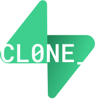
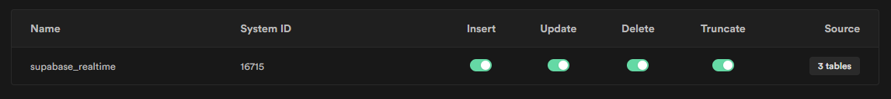
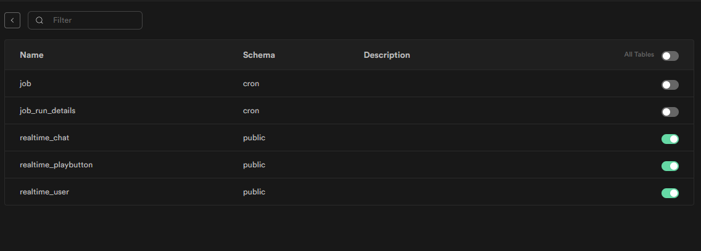
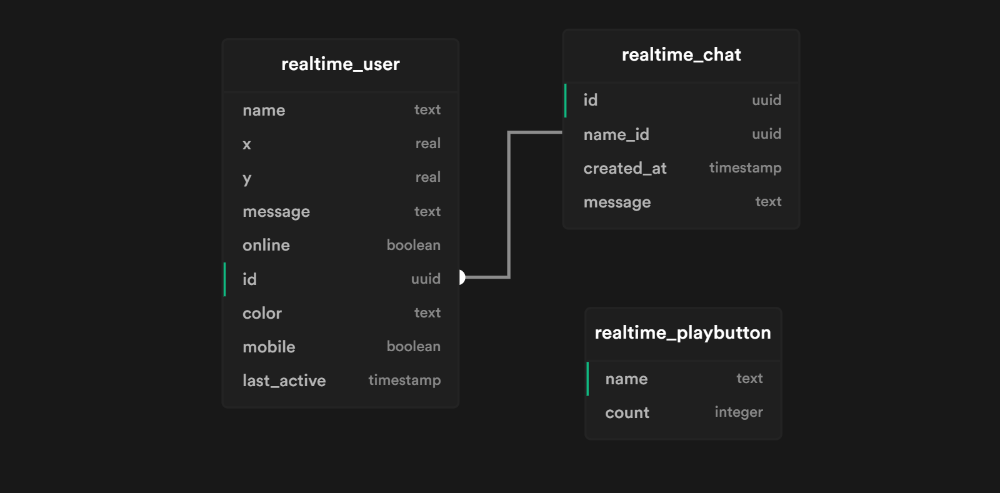

<!-- PROJECT LOGO -->
<br />
<p align="center">
  <a href="https://github.com/zernonia/supabase-realtime-nextconf-clone">
    
  </a>

  <h3 align="center">Supabase Realtime NextConf Clone</h3>

  <p align="center">
    Fun & Simple <strong><a href="https://supabase.io/">Supabase</a> Realtime NextConf Clone.</strong>
    <br />
    Realtime Play Button • Realtime Chat.
    <br />
    <br />
    <a href="https://supabase-realtime-nextconf-clone.vercel.app//">View Demo</a>
    ·
    <a href="https://github.com/zernonia/supabase-realtime-nextconf-clone/issues">Report Bug</a>
    ·
    <a href="https://github.com/zernonia/supabase-realtime-nextconf-clone/issues">Request Feature</a>
  </p>
</p>


## 🚀 Features

- 🎉 Play around with other user across the internet
- ⌚ Realtime update Cursor and Button Count
- ⛅ Realtime chat

## 📇 About The Project

> _TLDR_ - **NextConf Realtime Clone using Supabase Realtime**

I was heavily inspired by [Next Conf](https://nextjs.org/conf#room-9q0s8) realtime ⌚ functionalities, and take some time on learning how Next implement it. Seems like they are using [Replicache](https://doc.replicache.dev/how-it-works) to implement the `Push/Pull` realtime functionalities.

Then I look around the internet and couldn't find any similar example, thus inspired me to take on the challenge, and utilizing [Supabase Realtime ⚡](https://supabase.io/docs/reference/javascript/subscribe) to replicate similar effect.

After long hour of studying and replicating, I'm proud to present this **Open Source Supabase Realtime NextConf Clone** Playground 🔥

> ⚠️ If you encountered any bugs🐛, please report it so that I can prepare my Bug Spray!

### 🔨 Built With

- [Supabase](https://supabase.io/)
- [Supabase Realtime](https://supabase.io/docs/reference/javascript/subscribe)
- [Vue 3](https://v3.vuejs.org/)
- [Vite](https://vitejs.dev/)
- [WindiCSS](https://windicss.org/)

## Supabase Backend Settings

### :warning: Repliation Settings (IMPORTANT)

Remember to follow [Supabase Dashboard Realtime Settings](https://supabase.io/docs/guides/api#managing-realtime) to enable **Realtime**, as such




### Schema



> Generated by [Supabase Schema](https://supabase-schema.vercel.app/)

```sql
-- Schema
-- user table
create table realtime_user (
  id uuid default uuid_generate_v4() primary key,
  name text,
  x real,
  y real,
  message text,
  online boolean,
  color text,
  mobile boolean,
  last_active timestamp default now()
);

-- chat table
create table realtime_chat (
  id uuid default uuid_generate_v4() primary key,
  name_id uuid references realtime_user (id),
  created_at timestamp default now(),
  message text
);

-- playbutton table
create table realtime_playbutton (
  name text not null primary key,
  count integer
);


-- RLS
-- enable RLS for user table
alter table public.realtime_user enable row level security;

create policy "Enable access to all users" on public.realtime_user for
select using (true);

create policy "Enable insert for all users" on public.realtime_user for
insert with check (true);

create policy "Enable update for all users" on public.realtime_user for
update using (true) with check (true);


-- enable RLS for chat table
alter table public.realtime_chat enable row level security;

create policy "Enable access to all users" on public.realtime_chat for
select using (true);

create policy "Enable insert for all users" on public.realtime_chat for
insert with check (true);


-- enable RLS for play button table
alter table public.realtime_playbutton enable row level security;

create policy "Enable access to all users" on public.realtime_playbutton for
select using (true);

create policy "Enable update for all users" on public.realtime_playbutton for
update using (true) with check (true);


-- Function
-- CRON job as a fallback when frontend failed to detect user closed app or browser
create extension if not exists pg_cron;
grant usage on schema cron to postgres;
grant all privileges on all tables in schema cron to postgres;

select
  cron.schedule(
    'make-inactive-user-offline',
    '* * * * *', -- every minute
    $$
      update public.realtime_user
        set online = false
        where online = true and now() - INTERVAL '1 min' > last_active
    $$
  );

-- play button increment
create or replace function realtime_playbutton_addon(a text)
returns void as
  $$
  begin
    update public.realtime_playbutton
    set count = count + 1 where name = a;
  end;
  $$
language plpgsql;


```

## 🌎 Local Development

### Prerequisites

Yarn

- ```sh
  npm install --global yarn
  ```

### Development

1. Clone the repo
   ```sh
   git clone https://github.com/zernonia/supabase-realtime-nextconf-clone.git
   ```
2. Install NPM packages
   ```sh
   yarn install
   ```
3. Run Development instance
   ```sh
   yarn dev
   ```

## ➕ Contributing

This project is just for fun, but if you have any crazy idea for Realtime function, feel free to contribute, or create request for the features. Any contributions you make are **greatly appreciated**.

1. Fork the Project
2. Create your Feature Branch (`git checkout -b feature/AmazingFeature`)
3. Commit your Changes (`git commit -m 'Add some AmazingFeature'`)
4. Push to the Branch (`git push origin feature/AmazingFeature`)
5. Open a Pull Request

## 🙏 Acknowledgement

1. [Next Conf](https://nextjs.org/conf) for the inspiration.
2. [Replicache](https://doc.replicache.dev/how-it-works) for studying how to replicate similar effect

## 📈 Analytics

I'm using [Umami Analytics](https://umami.is/docs/about) because I'm interested in the distributions of user who uses Supabase and this tool.

[This](https://umami-zernonia.vercel.app/share/X9ZCYkQJ/Supabase%20Realtime%20NextConf%20Clone) is the public URL for the analytics. Enjoy!

## 📜 License

Not Associated with Supabase.

Distributed under the MIT License. See `LICENSE` for more information.

## 📧 Contact

Zernonia - [@zernonia](https://twitter.com/zernonia) - zernonia@gmail.com

## ☕ Support

If you like my work, please buy me a coffee 😳

[](https://www.buymeacoffee.com/zernonia)
